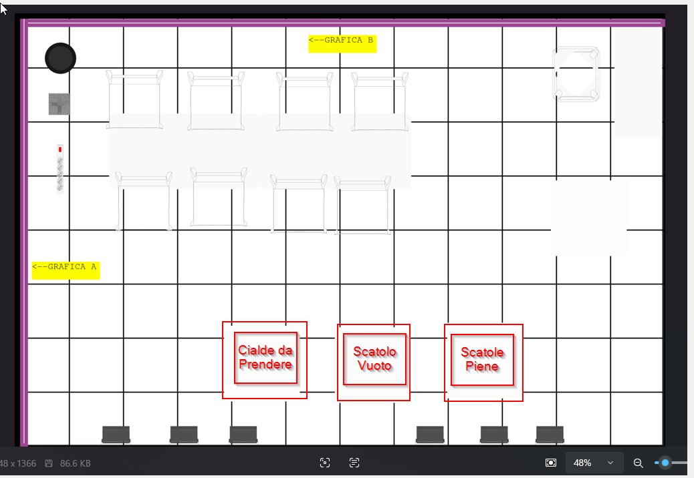

# Ciruzzo - Demo Fiera Agibot X2

**Pick & Place Cialde Caffe + Interazione Vocale**

Ciruzzo e un robot umanoide Agibot X2 che raccoglie cialde di caffe da un tavolo, le mette in una scatola (griglia 4x5, 20 cialde), e quando la scatola e piena la sposta su un tavolo dedicato e ne prende una vuota. I visitatori possono anche chiamarlo per nome per chiacchierare!

<p align="center">
  
</p>

## Layout Fiera

| Tavolo | Posizione | Funzione |
|---|---|---|
| Cialde da Prendere | Sinistra | I visitatori appoggiano le cialde qui |
| Scatola Attiva | Centro | Scatola in fase di riempimento |
| Scatole Piene | Destra | Deposito scatole completate |

I 3 tavoli (70x70 cm) possono essere spostati liberamente: Ciruzzo si adatta in automatico.

---

## Interazione Vocale

Ciruzzo risponde quando lo chiami!

```
Visitatore: "Ciruzzo!"
Ciruzzo:    "Eccomi! Sono Ciruzzo! Vuoi che ti preparo un pacco
             oppure vuoi parlare con me?"

Visitatore: "Voglio parlare"
Ciruzzo:    "Ue, bello! Parliamo un po'! Chiedi quello che vuoi!"
            (conversa usando ChatGPT in italiano napoletano)

Visitatore: "Prepara il pacco"
Ciruzzo:    "Subito! Torno a preparare i pacchi! Jamm ja!"
            (riprende la routine packaging)
```

### TTS Italiano (3 livelli di fallback)

| Priorita | Backend | Qualita | Requisiti |
|---|---|---|---|
| 1 | **OpenAI TTS** | Eccellente, voce naturale | API key OpenAI |
| 2 | **gTTS** (Google) | Buona | Connessione internet |
| 3 | **pyttsx3** | Sufficiente | Nessuno (offline) |

### STT (Speech-to-Text)

Whisper (locale) per riconoscimento vocale in italiano.

---

## Architettura

```
agibotx2_fiera/
├── config/
│   ├── demo_config.yaml            # Tutti i parametri configurabili
│   └── joint_limits.yaml           # Limiti giunti braccio
├── src/
│   ├── main_node.py                # Nodo ROS2 principale
│   ├── state_machine.py            # FSM con 18 stati
│   ├── states/                     # Implementazione stati
│   │   ├── base_state.py           #   Classe base
│   │   ├── idle.py                 #   Attesa cialde + ascolto wake word
│   │   ├── scan_tables.py          #   Rileva posizione 3 tavoli
│   │   ├── detect_pods.py          #   YOLO detection cialde
│   │   ├── navigate.py             #   Cammina tra tavoli (4 varianti)
│   │   ├── pick_pod.py             #   Afferra cialda (IK + gripper)
│   │   ├── place_pod.py            #   Deposita in scatola + check piena
│   │   ├── close_box.py            #   Chiude scatola (coperchio)
│   │   ├── carry_box.py            #   Trasporta scatola piena
│   │   ├── replace_box.py          #   Sostituisce con scatola vuota
│   │   ├── conversation.py         #   Chiacchiera con ChatGPT
│   │   └── error_recovery.py       #   Gestione errori
│   ├── perception/
│   │   ├── camera_manager.py       #   RGB-D camera (10Hz)
│   │   ├── pod_detector.py         #   YOLOv8n + Hough circles fallback
│   │   ├── table_detector.py       #   RANSAC plane segmentation
│   │   ├── pose_estimator.py       #   2D pixel + depth -> 3D
│   │   └── box_tracker.py          #   Conta cialde, posizione scatola
│   ├── manipulation/
│   │   ├── ik_solver.py            #   IK con Pinocchio (7 DOF)
│   │   ├── arm_controller.py       #   Comandi giunti braccio
│   │   ├── gripper_controller.py   #   OmniPicker (0.0-1.0)
│   │   ├── trajectory_planner.py   #   Ruckig (smooth + jerk limits)
│   │   └── predefined_poses.py     #   Pose chiave pre-registrate
│   ├── navigation/
│   │   ├── locomotion_controller.py#   Velocita camminata
│   │   ├── approach_planner.py     #   Visual servoing 3 fasi
│   │   └── position_tracker.py     #   Dead-reckoning + correzione visiva
│   ├── interaction/
│   │   ├── tts_client.py           #   TTS italiano (OpenAI/gTTS/pyttsx3)
│   │   ├── speech_recognizer.py    #   STT con Whisper
│   │   ├── chat_client.py          #   ChatGPT (personalita Ciruzzo)
│   │   ├── voice_interaction.py    #   Orchestratore vocale completo
│   │   ├── emoji_client.py         #   Espressioni facciali display
│   │   ├── led_client.py           #   LED strip colorati
│   │   └── commentary.py           #   Script frasi per ogni stato
│   ├── robot_hal/
│   │   ├── mode_manager.py         #   STAND / LOCOMOTION / MANIPULATION
│   │   ├── input_source_manager.py #   Registrazione sorgente input
│   │   └── safety_monitor.py       #   Watchdog, temperature, limiti
│   └── utils/
│       ├── config_loader.py        #   Caricamento YAML
│       ├── transforms.py           #   Trasformazioni coordinate
│       └── ros_helpers.py          #   QoS, service retry
├── scripts/
│   ├── train_yolo.py               #   Training YOLOv8 cialde
│   ├── calibrate_hand_eye.py       #   Calibrazione camera-braccio
│   ├── record_poses.py             #   Registra pose braccio
│   ├── test_perception.py          #   Test camera, YOLO, tavoli
│   ├── test_manipulation.py        #   Test IK, braccio, gripper
│   ├── test_navigation.py          #   Test camminata, approccio
│   └── test_full_cycle.py          #   Test ciclo completo
├── launch/
│   └── demo_launch.py              #   ROS2 launch file
├── .env                            #   API keys (NON committare!)
├── .gitignore
├── setup.py
├── package.xml
└── requirements.txt
```

---

## State Machine

```
                         ┌─────────────────────────────────────────────────┐
                         │                                                 │
INIT ──► SCAN_TABLES ──► IDLE ◄────────────────────────────────────────────┤
                          │ │                                              │
            cialda rilevata │  "Ciruzzo!"                                  │
                          │ │                                              │
                          │ ▼                                              │
                          │ WAKE_WORD_DETECTED                             │
                          │   │         │                                  │
                          │ "parlare" "pacco"                              │
                          │   │         └──► IDLE                          │
                          │   ▼                                            │
                          │ CONVERSATION ──────────────────────► IDLE      │
                          │                                                │
                          ▼                                                │
                    NAV_TO_POD_TABLE ──► DETECT_PODS ──► PICK_POD          │
                                                           │               │
                                                           ▼               │
                                                    NAV_TO_BOX_TABLE       │
                                                           │               │
                                                           ▼               │
                                                    PLACE_POD_IN_BOX       │
                                                           │               │
                                                           ▼               │
                                                       CHECK_BOX           │
                                                      /         \          │
                                              count<20           count==20 │
                                                 │                  │      │
                                                 └──► IDLE     CLOSE_BOX  │
                                                                    │      │
                                                                CARRY_BOX  │
                                                                    │      │
                                                          NAV_TO_FULL_TABLE│
                                                                    │      │
                                                            PLACE_FULL_BOX │
                                                                    │      │
                                                        NAV_BACK_TO_BOX    │
                                                                    │      │
                                                            GET_EMPTY_BOX  │
                                                                    │      │
                                                          PLACE_EMPTY_BOX ─┘

Evento globale: tavolo spostato ──► SCAN_TABLES (da qualsiasi stato)
```

---

## Setup

### Requisiti

- **Hardware**: Agibot X2 con Jetson Orin NX (PC2: 10.0.1.41)
- **Software**: ROS2 Humble, Python 3.10+
- **Connessione**: Ethernet diretto, IP statico 10.0.1.2

### Installazione

```bash
# Clona il repository
cd ~/ros2_ws/src
git clone <repo_url> agibotx2_fiera

# Installa dipendenze Python
pip install -r agibotx2_fiera/requirements.txt

# Configura la chiave OpenAI (per ChatGPT + TTS)
echo "OPENAI_API_KEY=sk-proj-..." > agibotx2_fiera/.env

# Build ROS2
cd ~/ros2_ws
colcon build --packages-select agibotx2_fiera
source install/setup.bash
```

### Configurazione

Tutti i parametri sono in `config/demo_config.yaml`:

- **Velocita camminata**: `navigation.max_speed_ms` (default 0.3 m/s)
- **Cialde per scatola**: `pods.max_per_box` (default 20)
- **Voce TTS**: `interaction.tts.openai_voice` (nova, echo, onyx, ...)
- **Modello YOLO**: `perception.yolo.model_path`
- **Wake word**: `interaction.voice.wake_word` (default "ciruzzo")

---

## Esecuzione

### Avvio demo completa

```bash
ros2 launch agibotx2_fiera demo_launch.py
```

### Avvio diretto

```bash
ros2 run agibotx2_fiera demo_node
```

### Con configurazione custom

```bash
ros2 launch agibotx2_fiera demo_launch.py config_path:=/path/to/custom_config.yaml
```

---

## Test

### Test singoli moduli

```bash
# Test percezione (camera, YOLO, tavoli)
python scripts/test_perception.py --test all

# Test manipolazione (IK, braccio, gripper, traiettorie)
python scripts/test_manipulation.py --test all

# Test navigazione (camminata, approccio, tracking)
python scripts/test_navigation.py --test all
```

### Test ciclo completo

```bash
# Singola cialda (senza camminata)
python scripts/test_full_cycle.py --single-pod

# Scatola completa (20 cialde)
python scripts/test_full_cycle.py --full-box
```

### Calibrazione

```bash
# Calibrazione hand-eye camera-braccio
python scripts/calibrate_hand_eye.py --pattern-size 7x5 --square-size 0.03

# Registra pose braccio (interattivo)
python scripts/record_poses.py --side left
```

### Training YOLO

```bash
# Training modello detection cialde
python scripts/train_yolo.py --data dataset/cialde.yaml --epochs 100 --export-tensorrt
```

---

## Scelte Tecniche

| Componente | Scelta | Motivazione |
|---|---|---|
| Object Detection | YOLOv8n + TensorRT FP16 | 3-5ms su Jetson Orin, robusto |
| Fallback detection | Hough Circles (OpenCV) | Cialde sono dischi ~44mm |
| IK Solver | Pinocchio | Veloce, 7-DOF, URDF nativo |
| Traiettorie | Ruckig | Smooth con limiti jerk |
| Table Detection | Open3D RANSAC | Piani orizzontali senza training |
| Navigazione | Visual servoing + dead-reckoning | SDK senza odometria |
| TTS | OpenAI TTS > gTTS > pyttsx3 | Italiano naturale con fallback |
| STT | Whisper (locale) | Privacy, no cloud obbligatorio |
| Chat | OpenAI GPT-4o-mini | Conversazione naturale italiana |
| Scatola | Coperchio appoggiato | Evita complessita meccanica |

---

## Sicurezza

- **Mai usare PC1** (10.0.1.40) per sviluppo SDK
- Velocita max camminata: **0.3 m/s** (conservativa per demo pubblica)
- Margine limiti giunti: **5 gradi** dal limite fisico
- Monitor temperatura motori: stop se > **60 C**
- Watchdog: se nessun heartbeat per **5s** -> emergency stop
- Verifica traiettoria prima dell'esecuzione
- **E-stop fisico obbligatorio** per demo pubblica

---

## Dipendenze Principali

```
ultralytics        # YOLOv8
open3d             # Point cloud, RANSAC
pinocchio          # Inverse kinematics
ruckig             # Traiettorie smooth
openai             # ChatGPT + TTS
openai-whisper     # Speech-to-Text
gTTS               # Google TTS (fallback)
pyttsx3            # TTS offline (fallback)
pygame             # Riproduzione audio
numpy, opencv-python, scipy, pyyaml
```

---

## Note

- La chiave API OpenAI va nel file `.env` (mai nel codice o nella config!)
- Le pose del braccio in `predefined_poses.py` sono placeholder: vanno calibrate sul robot reale con `scripts/record_poses.py`
- Il modello YOLO va trainato sulle cialde reali con `scripts/train_yolo.py`
- Per cambiare la voce di Ciruzzo: modifica `interaction.tts.openai_voice` nella config
